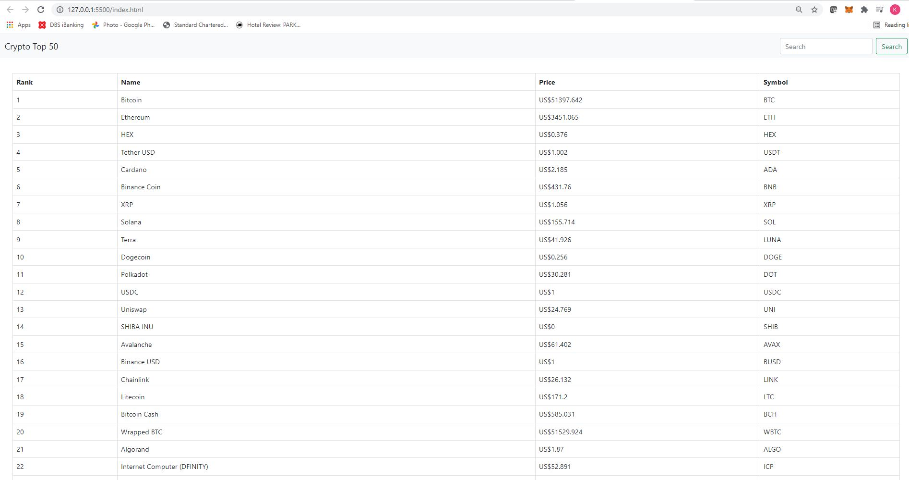

<h1 align=>NUS FinTech: DevOps CI/CD</h1>

## Overview  
---
#### A) CI/CD through GitHub Actions

GitHub Actions offers a large variety of tools for workflows. Through several failed attemps and trial & error, I settled on the following GitHub Actions:-

1. [Docker](https://github.com/khsir/DevOps_HW/blob/main/.github/workflows/docker-image.yml) which automates the build and push of the Docker image to DockerHub
2. [WhatsApp Notification via Twilio](https://github.com/khsir/DevOps_HW/blob/main/.github/workflows/whatsapp.yml) is simultaneously triggered with a notification on the details of the change committed
3. Google Cloud Build and Cloud Run which is done via GCP's APIs (more on that later)

 

#### B) Deployed Page

The deployed page uses a javascript(JS) to connect to [coinranking](https://coinranking.com/) API to pull information on cryptocurrencies:-

https://khsir.github.io/DevOps_HW/index.html

 
 

## Part 1: Initialise a Repository 
---
Initialise an empty repository and uploading the relevant files to the respository. 

For this exercise, I used a JS file that connects to an external API. The HTML file displays a table of the Top 50 largest cryptocurrencies:

**_Screenshot of Webpage_**

 
 

## Part 2: Choosing the GitHub Action (Failure)

I started the DevOps project with an open mind as to the choice of workflows. The first workflow I tried was [Build and Deploy to GKE](https://github.com/google-github-actions/setup-gcloud/tree/master/example-workflows/gke) - I failed miserably. There were a few reasons for that: 
* Relatively new to Docker and hadn't yet a firm understanding of Docker Image, Containers, etc
* Unfamiliar with the language on .YML files
* Hadn't quite realise the difference between GKE and GCP 

 
 

## Part 3: Changing Track (Docker & WhatsApp Notification)

### Docker Image CI 
Almost decided to switch to Homework #1 instead, but found this article on [medium](https://medium.com/platformer-blog/lets-publish-a-docker-image-to-docker-hub-using-a-github-action-f0b17e5cceb3). 

For this .YML file, we are required to have three (3) parameters:

The following parameters are required:
* <b> username </b>: Docker username
* <b> password </b>: Docker account's password
* <b> tag </b>: Docker hub repository

Each of these inputs can be written directly onto the docker-image.yml files. However, one should note that this repository is public hence personal information such as the username and password will be available to the public. It is thus important (and useful) to utilise [GitHub Secrets](https://docs.github.com/en/actions/security-guides/encrypted-secrets).

To test the file, one hits Git ADD, Git Commit, Git Push Origin Main. If the workflow is successful, changes to the Docker Hub repository will be reflected.

**_Successful Deployment_**

 
 

### WhatsApp Notify
Building on the momentum, I decided to incorporate a push notification an instant messaging platform.  

The steps to incorporate this action are as follows:- 
1. Copy the [.YML](https://github.com/mdb571/wa-action/blob/master/.github/workflows/main.yml) code
2. Create a free [Twilio](https://www.twilio.com/) account
3. Join the Twilio WhatsApp sandbox by sending a unique code to +1 415 523 8886 (Twilio's default WhatsApp number). This allows a user to send/recieve messages from Twilio

We will use the same principles as the Docker Image CI ie. GitHub Secrets:
* <b> from </b>: Twilio's default WhatsApp numer ie. +1 415 523 8886
* <b> to </b>: User's mobile number used to activate Twilio WhatsApp sandbox (see Step 3 above)
* <b> account SID </b>: Twilio account SID 
* <b> auth token </b>: Authentication token for the Twilio account SID

Upon the Github trigger, a WhatsApp notification is sent to user to notify them on the changes made:
* Github event type (e.g. Push, Pull, etc)
* User who triggered the event and made the commit

**_WhatsApp Notification:_** 
 

 
 

## Part 4: Google Cloud Run Deployment Workflow 

Finally I had also attempted to incorporate a Google Cloud Run. 

I started with a .YML file with several of the key configs contained within. However I couldn't figure out how to build an image:
* Code: Can't figure if it is meant to be docker build -t or gcloud builds submit --tag
* Image: Can't figure how to link it to the Dockerfile in my GitHub Repo

Thankfully (or maybe not), Google Cloud has numerous APIs that allows users to build, test and deploy directly from GCP; there are also numerous resources that can help one reach that end point.

**_GCP Failure on .YML File:_** 
 

 
 

**_GCP Success via APIs:_** 
 

 
 

## Thank You!